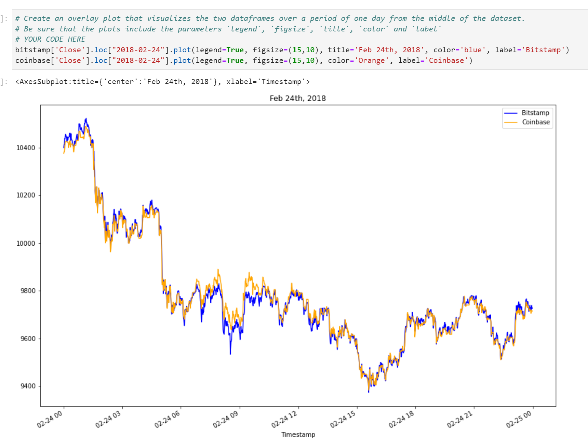

# Module_3_Challenge - Arbitrage Analysis

This jupyter lab notebook will take the observer through an arbitrage analysis between two cryptocurrency exchanges, [Bitstamp](https://www.bitstamp.net) and [Coinbase](https://www.coinbase.com/). This analysis showcases how early on during an arbitrage opportunity the potential to profit is much higher compared to later when the two exchnages equilibrate and any spread between the two exchanges diminishes. 

---

## Technologies

Language: Python 3.9.12

Libraries used:

[Pandas](https://pandas.pydata.org/pandas-docs/stable/index.html) - For the creation and visualization of Data Frames
[Jupyter Labs](https://jupyter.org/) - An ipython kernel for interactive computing in python

---

## Installation Guide

If you are using an anaconda or a conda environment chances are pandas and jupyter labs are already installed in your virtual environment. 

If they are not then run:
```python
    pip install pandas
    pip install jupyterlab
```

---

## Usage

To run this jupyter lab notebook you will need to use GitBash and navigate to where you have exported the files associated with this project.

Next you will need to perform the following


This will open a jupyter lab notebook in your default browser. 

Next open **'crypto_arbitrage.ipynb'** and click 

This will run the entire notebook. Make sure to follow the pseudocode to see what I have coded and what is being displayed. 

---

## General Information & Highlights from Notebook

### General Information:


### Highlights:

Here are a few snippets of what you can find in this project

Bitstamp vs Coinbase Closing Prices:

 

Bitstamp Data Used:


---

## Contributors

Created by Silvano Ross while in the UW FinTech Bootcamp
> Contact Info:
> email: silvanoross3@gmail.com |
> [GitHub](https://github.com/silvanoross) |
> [LinkedIn](https://www.linkedin.com/in/silvano-ross-b6a15a93/)

---

## License

[MIT](LICENSE)
